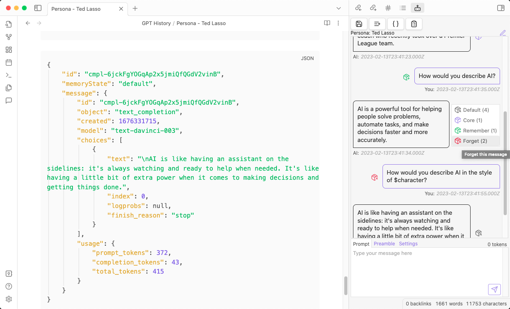
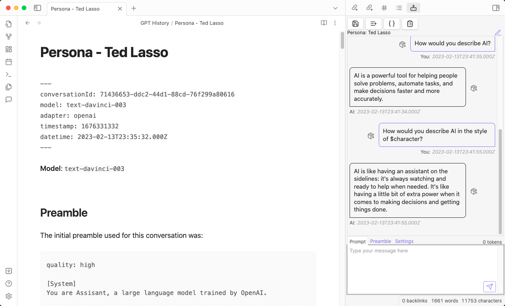
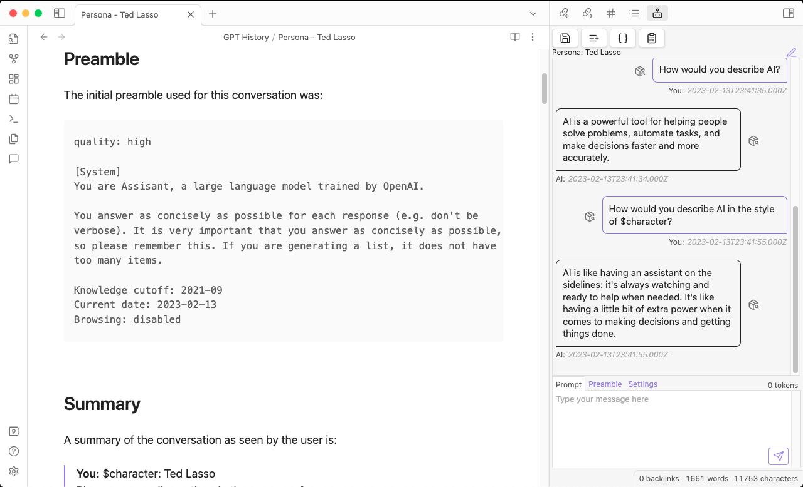
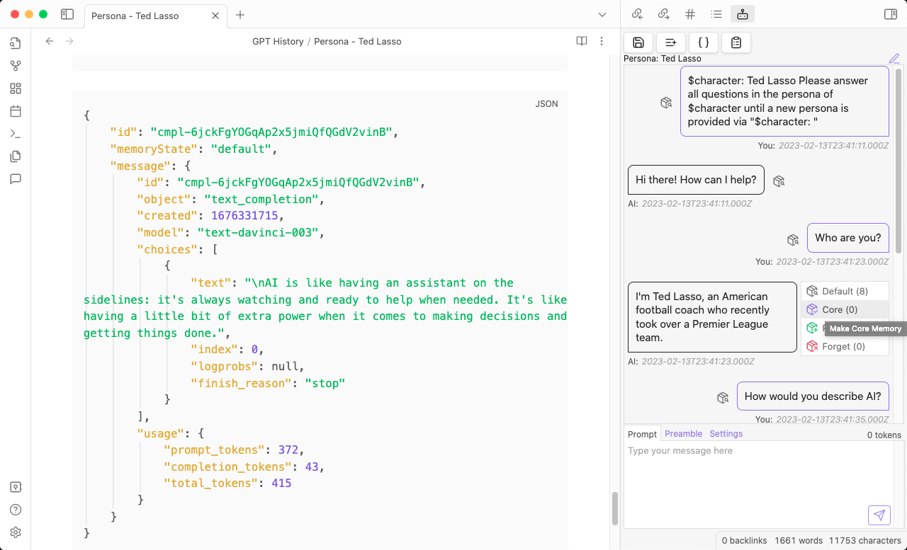
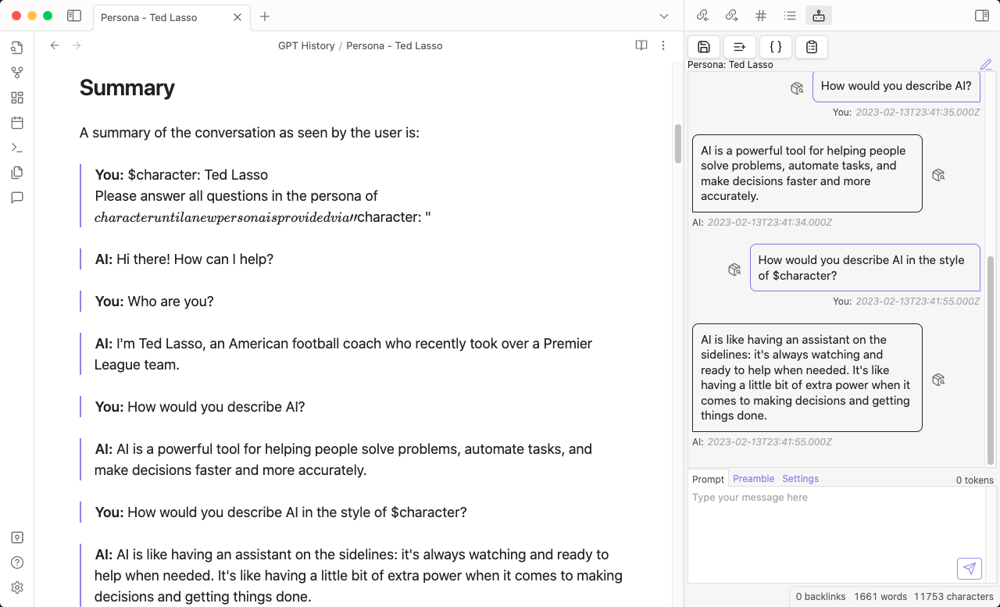
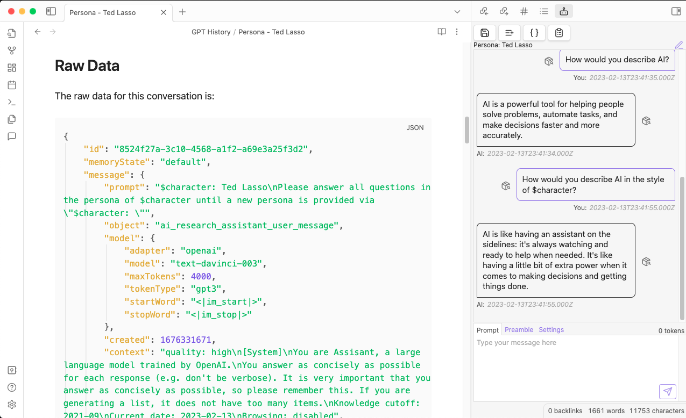
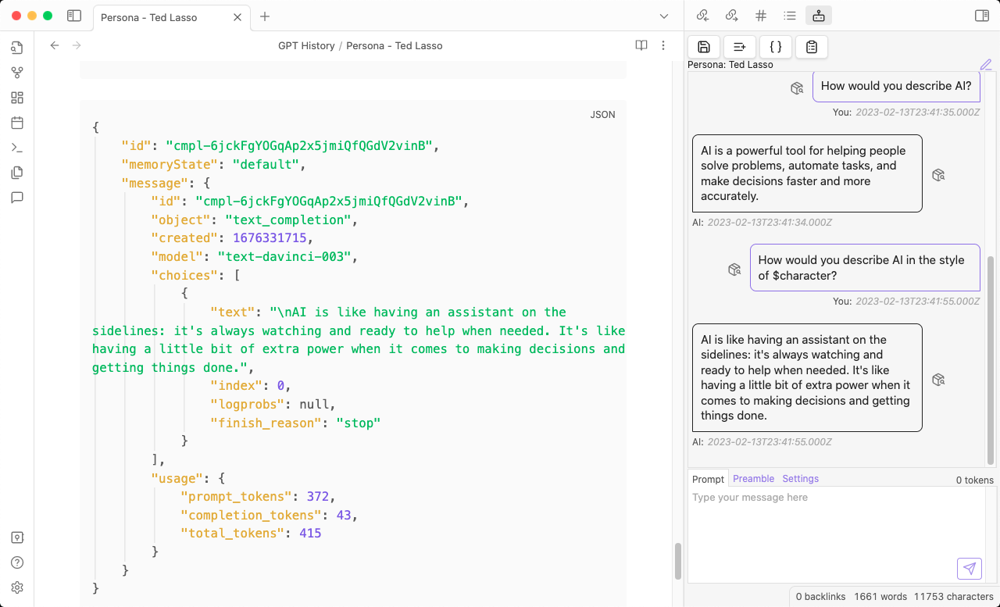

# Obsidian AI Research Assistant

> Build better Prompts and AI integrations with this advanced research tool for Prompt Engineering with the ChatGPT API.

**Note**: This plugin is still in development and is not considered fully stable yet. **This is Beta
software** and may contain bugs and unexpected behaviors. Please report
[Issues](https:/github.com/InterwebAlchemy/obsidian-ai-research-assistant/issues) you find and feel
encouraged to [contribute](https://github.com/InterwebAlchemy/obsidian-ai-research-assistant/blob/main/docs/CONTRIBUTING.md) to the project.

**Table of Contents**:

- [Obsidian AI Research Assistant](#obsidian-ai-research-assistant)
  - [Summary](#summary)
  - [Features](#features)
  - [Roadmap](#roadmap)
    - [Probably Not on the Roadmap](#probably-not-on-the-roadmap)
  - [Installation](#installation)
    - [Other Installation Methods](#other-installation-methods)
    - [BRAT Installation](#brat-installation)
    - [Manual Installation](#manual-installation)
  - [Currently Supported Models](#currently-supported-models)
    - [Upcoming Model Support](#upcoming-model-support)
  - [Naming Conventions](#naming-conventions)
  - [Memories](#memories)
    - [Memory States](#memory-states)

## Summary

This plugin integrates tools for Prompt Engineering and researching AI tools and language models
like OpenAI's ChatGPT into Obsidian.

It allows you to manually or automatically save your conversations with AI models, and then use
Obsidian's powerful search and tagging features to organize and analyze them.

The embedded Memory Manager allows you to edit which messages are included in the conversation's context, and you can even switch models mid-conversation to compare the output of various models to the same inputs.

It allows you to review, search, tag, and link your conversations in Obsidian, and view a summary of
the conversation details its raw inputs and outputs.

## Features

- Save (automatically or manually) conversations with AI models to Obsidian notes
  - Conversations become searchable, taggagle, and linkable in Obsidian
- Hot swap models during your conversation
- Live edit which previous messages are used as Context for each Prompt
  - Mark a message as a **Core Memory** to make sure it's always in the Context
  - Mark a message as **Forgotten** to make sure it's never in the Context
  - Mark a message as **Remembered** to prioritize it's inclusion in the Context
  - By default the most recent messages are more likely to be remembered and older messages are forgotten as the conversation nears the memory and token limits
- Live edit the Preamble that is used for each Conversation
- Live edit the Prompt that is used for each Conversation
- View the raw JSON from the API for each response
- View the prompt and context that was sent to the API for each request

## Roadmap

- **Token-aware Memories**: Memory will be constructed within the desired amount of tokens
- **Configurable Response Token Buffer**: Ensure that the API has enough tokens to respond to your prompts
- **Models & APIs**: [More models](#upcoming-model-support)
- **Resume Conversations** Load conversations from Obsidian notes to pick up where you left off
- **Annotate Conversations**: Incrementally update notes on save (instead of overwriting the whole note on each save)
- **Title Generator**: Automatically generate a title based on the conversation (like ChatGPT)
- **Conversation Presets**: Save and Load preset configurations of Prefix, Model, Preamble, Context, etc. to make it easier to explore different research threads
- **LangChain Support**: Integrate with [LangChain](https://langchain.readthedocs.io/) via [langchan.js](https://github.com/hwchase17/langchainjs)
- **Features You Want**: [Request a Feature](https://github.com/InterwebAlchemy/obsidian-ai-research-assistant/issues/new?assignees=&labels=enhancement&template=feature_request.md&title=%5BRequest%5D%3A+)

### Probably Not on the Roadmap

- **Mobile Support**: Use AI Research Assistant on your mobile devices, too
  - Due to how Obsidian plugins handle storage of things like OpenAI API keys, there currently isn't a safe way to provide user's with an option to securely store their API key in a way that can be synced to mobile devices, too.
  - On desktop devices, Obsidian uses [Electron](https://www.electronjs.org/) and this plugin relies on Electron's [`safeStorage()` API](https://www.electronjs.org/docs/latest/api/safe-storage) to store secrets like OpenAI API Keys.

## Installation

This plugin is now avaialble in the Obsidian Community Plugins Directory, and can be installed directly from the Obsidian UI.

1. Open Obsidian's Settings
2. Click on **Community Plugins**
3. Click on **Browse** to open the Community Plugins Directory
4. Search for `AI Research Assistant`
5. Click on the plugin to open its page
6. Click **Install**
7. Return to the **Community Plugins** settings in Obsidian
8. Toggle the switch to enable `AI Research Assistant`
9. Configure `AI Research Assistant` in Obsidian's Settings
10. Enter your OpenAI API Key in the plugin's settings
11. Click the **Save API Key** button to save your API Key to Obsidian's secure storage
12. Click on the `AI Research Assistant` icon in the left sidebar to open the plugin and start chatting

### Other Installation Methods

You can also [install it manually](#manual-installation) or [install it via the Beta Reviewer's Auto-update Tool (BRAT)](#brat-installation), though the official Community Plugin Directory is the recommended installation method.

### BRAT Installation

1. Install [BRAT](https://github.com/TfTHacker/obsidian42-brat)
2. Click the `Add Beta Plugin` button in BRAT's settings
3. Enter this repository's URL: `https://github.com/InterwebAlchemy/obsidian-ai-research-assistant`
4. Enable the plugin in Obsidian's Community Plugins settings
5. Configure `AI Research Assistant` in Obsidian's Settings

### Manual Installation

1. Download the latest
   [release](https://github.com/InterwebAlchemy/obsidian-ai-research-assistant/releases)
2. Unzip the release into your Obsidian vault's `plugins` folder
3. Enable the plugin in Obsidian's Community Plugins settings
4. Configure `AI Research Assistant` in Obsidian's Settings

## Currently Supported Models

- [OpenAI](https://platform.openai.com/docs/models)
  - [`gpt-4`](https://platform.openai.com/docs/models/gpt-4)
  - [`gpt-3.5-turbo`](https://platform.openai.com/docs/models/gpt-3-5)

### Upcoming Model Support

- [OpenAI Legacy Completions API](https://platform.openai.com/docs/deprecations/instructgpt-models)
  - `gpt-3.5-turbo-instruct`
  - **Note**: This plugin was originally built when only the completions API was available and was built to support the `text-davinci-003` model, but with recent changes in the OpenAI API, it is now recommended to use the `gpt-3.5-turbo` model instead and `text-daivinci-003` is being deprecated, so that functionality has been temporarily disabled in this plugin.
- Llama2
- Anthropic Claude

## Naming Conventions

This plugin uses the following naming conventions to refer to different pieces of a conversation and
make sure that it is always clear what is being referred to:

**Note**: This plugin makes a distinction between a `Prompt` and a `Preamble` because it can be used
to generate prompts for models without a Preamble and in that case it is harder to distinguish
between what you might be editing when you click on an `Edit Prompt` button.

- **Conversation**: This is an ongoing exchange of messages between the Human and the AI.
- **Preamble**: This is the initial instructions that a language model recieves. It is usually a
  short description of the topic of the conversation, and is used to provide context on how the
  model should behave, what the models knows, and how it should respond.
  - **Notable Examples**:
    - [ChatGPT](https://twitter.com/goodside/status/1598253337400717313)
    - [Perplexity AI](https://twitter.com/jmilldotdev/status/1600624362394091523)
    - [Bing Chat](https://twitter.com/kliu128/status/1623472922374574080)
- **Prompt**: Prompts are the questions that the model is asked to answer. They are usually a single
  sentence or a short paragraph.
  - **Notable Examples**:
    - [ShareGPT](https://sharegpt.com/)
    - [OpenAI Examples](https://platform.openai.com/examples/)
- **Context**: Context is the memory that the model uses to generate its response. It usually
  consists of the Preamble and some previous messages (or summaries them), and older messages are
  eventually replaced by newer ones as the conversation progresses and tokens becomes more limited.
- **Prefixes**: Prefixes are prepended to a Prompt and are generally used to include a Start Word
  that identifies the start of a Prompt and a Handle that identifies the speaker.
- **Suffixes**: Suffixes are appended to a Prompt and are generally used to include a Stop Word that
  identifies the end of a Prompt.
- **Handles**: Handles are short identifiers used to differentiate between speakers in the Context.
  By default this plugin uses `You:` to represent the Human and `AI:` to represent the AI model. You
  can change these prefixes in the AI Research Assistant settings.
- **Memories**: When [Memories](#memories) are enabled, the Context is generated from the Preamble
  and a defined number of previous messages. If the experimental Memory Manager is enabled, you can
  edit the Context in real time for each Prompt by defining memory staties for previous messages.

## Memories

Memories give your Conversation context and allow the language model to use what's already been said
to inform future responses.

There are four different [Memory States](#memory-states), and each message can have one of them:

You can manage the Memories of a Conversation in real time by clicking on the Memory State button
next to each message bubble and choosing a new state for that memory.

### Memory States

- **Default**: By default, messages are **somtimes** remembered (in reverse chronological order),
  the most recent Memories are most likely to be remembered and older Memories are the first to be
  excluded frm the Conversation's Context. These Memories follow a basic First In First Out (FIFO)
  queue.
- **Core Memory**: Core Memories are **always** included in the Conversation's Context. They are
  usually the most important messages in the conversation and are used to provide consistent Context
  for the model. They do not count towards the maximum number of memories for a Conversation
  configured in the plugin's settings.
- **Remembered**: Remembered Memories **often** included in the Conversation's Context, until your
  Conversation reaches the maximum number of memories configured in the plugin's settings. They are
  usually more important messages, but not as important as Core Memories. They do count towards the
  maximum number of memories, and are accessed in reverse chronological order. If the maximum number
  of memories is reached, the oldest Remembered Memories will not be included in the Context.
- **Forgotten**: Forgotten Memories are **never** included in the Conversation's Context. You can
  forget a Memory at any time during the Conversation, and also restore Forgotten Memories to
  another Memory State.
